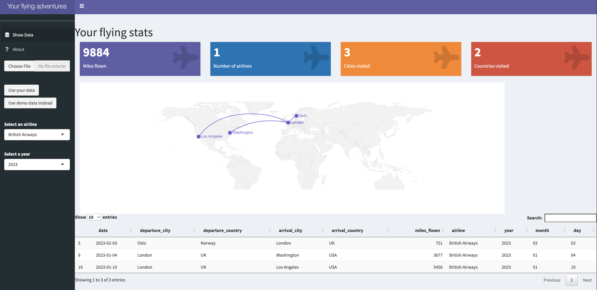

# your_flying_adventures
This is a (minimal) R Shiny app to visualise your flying travels.   

To run the app on the web go to https://danai-fimereli.shinyapps.io/your_flying_adventures/   

## Installation

This Shiny app was build in R 4.0.2 and required the installation of the following packages: shiny(v1.6.0), readxl (v1.3.1), maps (v3.4.0), geosphere (v1.5-14), DT (v0.16)

## Running

To run the app localy: shiny::runGitHub("dfimerel/your_flying_adventures")

